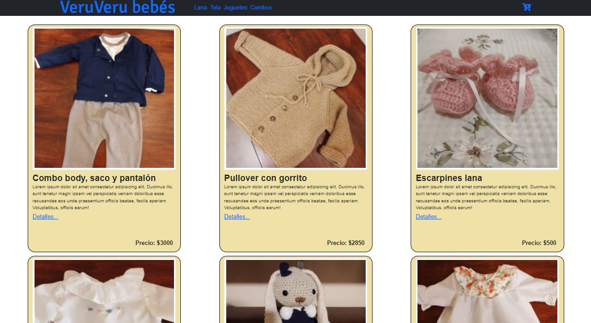
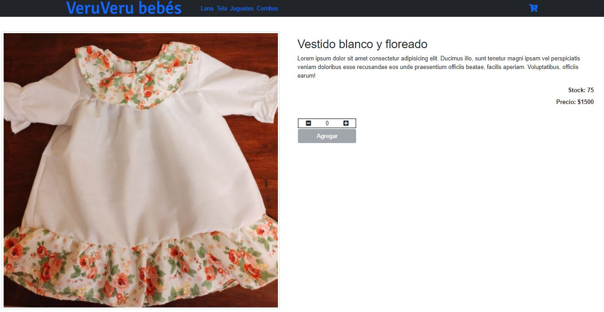
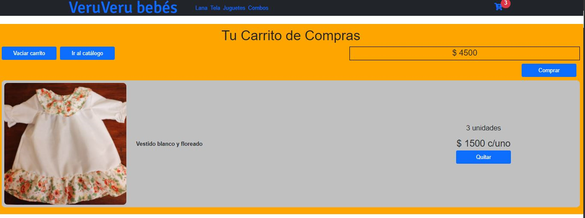

# VeruVeru Web
VeruVeru es un e-comerce dedicada a la venta de ropa para bebés. En la misma hay un catálogo de productos, y se pueden realizar pedidos a través de un carrito de compras implementado en la misma.

---
## Estructura del sitio
El sitio cuenta con las siguientes páginas

- pagina principal, conteniendo el catalogo de todos los productos que ofrece la tienda
- paginas de cada categoria, habiendo 4 categorias que son Lana, Tela, Juguetes y Combos (con productos de distintas categorias)
- pagina de detalle para cada item, en donde se puede ver informacion detallada del producto seleccionado y en donde se pueden agregar productos al carrito de compras
- carrito de compras

---
## Screenshots
### Catálogo de productos

### Detalle de un producto

### Carrito de compras

---
## Comenzando 🚀
Las siguientes instrucciones nos permitirán preparar el entorno, bajar los fuentes de la aplicación y ejecutarla de manera local.
### Pre-requisitos 📋
Usted debe tener instalado en su equipo una versión reciente de Node.js, y debe tener instalada la aplicación git bash.
### Descarga de los fuentes de la aplicación 🔧
Para descargarse este repositorio localmente debe:

1. En su disco duro crear un directorio en donde va a descargar los fuentes.

2. Desde la consola de git bash posicionarse en ese directorio y ejecutar el siguiente comando:

    <code>git clone https://github.com/german-illesca/curso-react</code>

### Ejecución de la aplicación en el equipo local ⚙️
Para ejecutar la aplicación en su pc debe ejecutar los siguientes comandos:

1. Ejecutar desde la consola de git bash el siguiente comando para que se descarguen todas las dependencias:

    <code>npm install</code>

Esto solo se realiza la primera vez que va a ejecutarla.

2. Ejecutar desde la consola de git bash el siguiente comando para que la aplicación se ejecute localmente:

    <code>npm start</code>

3. Luego de esto la aplicación comenzará a ejecutarse y se abrirá en su browser una pestaña con el sitio web, y ya podrá usarlo de manera local.

---
## Construido con 🛠️
VeruVeru fue construido utilizando las siguientes tecnologías:

* [HTML](https://developer.mozilla.org/es/docs/Learn/Getting_started_with_the_web/HTML_basics)
* [CSS](https://developer.mozilla.org/es/docs/Learn/Getting_started_with_the_web/CSS_basics)
* [React.js](https://reactjs.org/)

---
## Autor ✒️
Germán Illesca - germanillesca (https://www.linkedin.com/in/germanillesca/)

***

